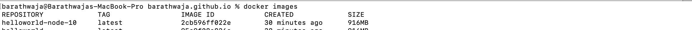
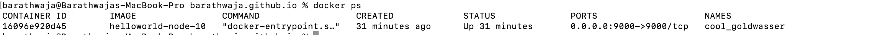

# node-helloworld-docker
This is a sample helloworld nodejs api running on docker container.

### Pre-Requisite
1) Install docker desktop for corresponding Operating System (https://www.docker.com/products/docker-desktop).
2) Once Installed, run the docker desktop.

### Steps to run the application in docker
1) git clone https://github.com/Barathwaja/node-helloworld-docker.git
2) cd helloworld
3) npm install
4) npm start
5) check the ExpressJS API is working or not
6) API Details
    - localhost:9000/
    - localhost:9000/hello

7) stop the NodeJS server using Ctrl+C

#### Docker Build Image
8) docker build -t helloworld-node-12 .   where -t is the tag of the docker image
  

#### Docker Run Image on Container
8) docker run -p 9000:9000 -d helloworld-node-12   where  
-p is to expose the internal port outside the docker container  
-d is to run the container in the detached mode
  

#### Docker Container Id
10) docker ps
#### Docker Container Logs
11) docker logs <container-id> 
#### Docker Interaction
12) docker exec -it <container-id> /bin/sh   where  
-it is interactive terminal session will be created with `sh` as interactive mode.
13) Follow Step 5 after checking logs